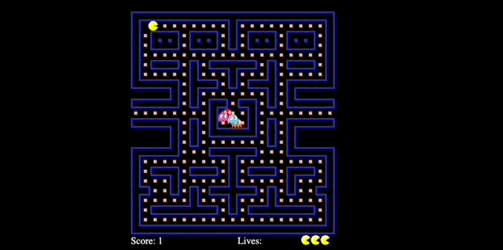

# 🕹️ Pacman Game 🕹️



Welcome to the Pacman game! This project is a recreation of the classic Pacman arcade game using HTML, CSS, and JavaScript. 
## 🌟 Features
- 🎮 **Classic Gameplay:** Control Pacman using the arrow keys and eat all the dots while avoiding the ghosts.
- 👻 **Ghost AI:** Experience challenging gameplay with intelligent ghost movements.
- 🔄 **Power-ups:** Eat power pellets to turn the tables and chase ghosts for extra points.
- 📈 **Score Tracking:** Keep track of your score as you progress through the levels.
- 🎨 **Visual Enhancements:** Enjoy a visually appealing game window with smooth animations and no white borders.
- 🔄 **Responsive Design:** The game layout is responsive and adjusts to different screen sizes.

## 🕹️ How to Play
1. **Clone** the repository to your local machine using the command:

   ```sh
   git clone https://github.com/your-username/pacman-game.git


2. Navigate to the project directory:
    ```bash
    cd pacman-game
    ```

3. Open the `pacman.html` file in your preferred web browser to start playing the game.

4. Controls: Use the arrow keys to move Pacman:

- Up: ⬆️
- Down: ⬇️
- Left: ⬅️
- Right: ➡️

5. Gameplay: Eat the dots, but be careful not to get caught by the ghosts! 

6. The scores will be updated accordingly. Enjoy the game and have fun reliving the nostalgia of Pacman!

